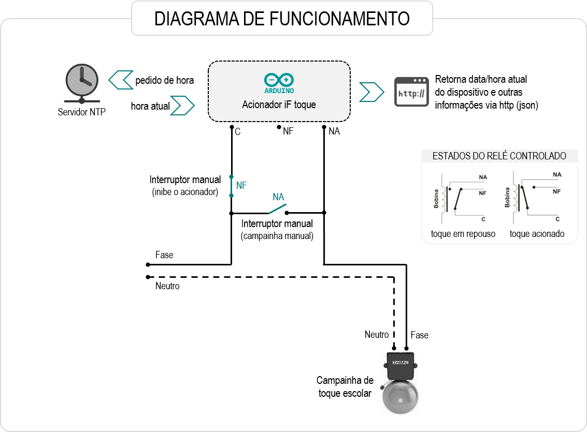
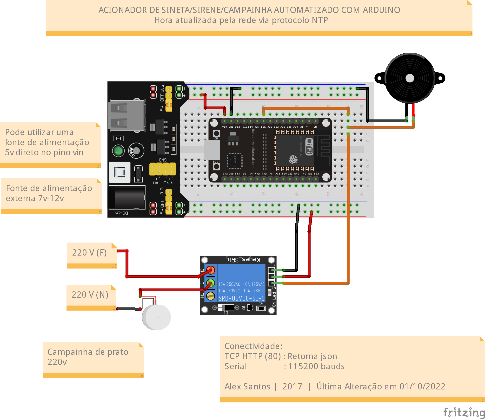
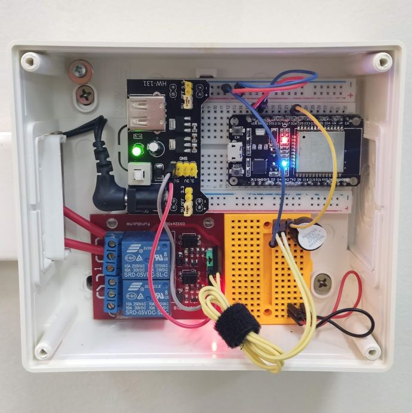
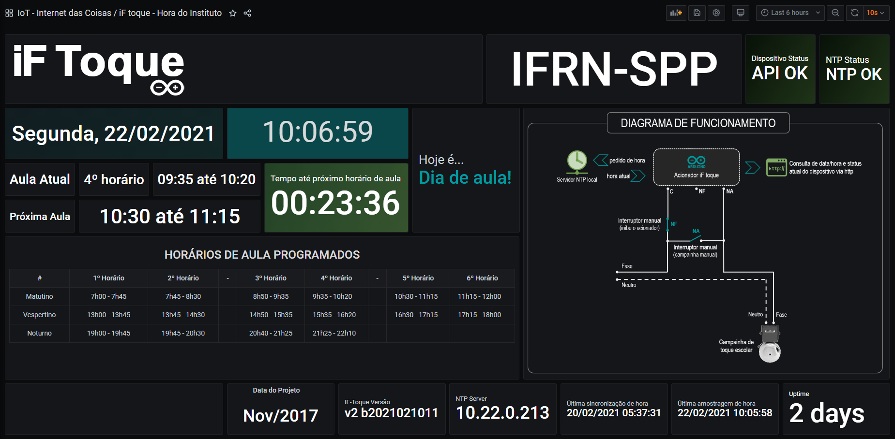

# iF-toque
Sistema para controle de toque escolar (campainha, sineta, sinal, sirene) baseado em esp32 com uso de relé com atualização de hora pela rede através de protocolo NTP (Network Time Protocol).

O iF-Toque é uma atualização do projeto [alarme_ifrn](https://github.com/dvcirilo/alarme_ifrn) desenvolvido por [dvcirilo](https://github.com/dvcirilo). Compõe o código fonte os arquivos .ino que foram compilados com arduino IDE versão 2.0. Os arquivos .ino devem ser colocados no mesmo diretório para a compilação ocorrer corretamente.

As horas dos acionamentos dos toques de sinal estão armazenadas no código fonte na função timeToStudy() e são separadas por toque longo ou toque curto. O toque curto  é aplicado quando entre as aulas e dura por padrão 3s. O toque longo (horário do inicio ou fim do intervalo, inicio de turno, etc) dura por padrão 7s. Feriados fixos estão definos na função DiadeAula() que retorna para timeToStudy() se o toque deve ser acionado ou não. Esses valores podem ser modificados pela edição das variáveis tempoCurto e tempoLongo.

Ao inicializar, o Esp32 irá tentar ajudar a hora a partir de um servidor NTP configurado na variável "ntpServer". Uma vez definida a hora, o iF-Toque tentará novas sincronizações com "ntpServer" a cada 1h para que a hora sempre permaneça atualizada. A cada sincronização de hora, o horário dessa sincronização em Unixepochtime será armazenado em last_ntp_update. Esse armazenamento é voltado para controle externo de gestão (monitoramento) e está definido na função timeSyncCallback().

O servidor web é utilizado como gerenciamento passivo do dispositivo para acompanhar se a hora do dispositivo está correta assim como para acompanhar: horário de aula atual, próxima aula, tempo para próxima aula, data/hora atual, uptime e data/hora atual no formato unix epoch time. Uma requisição http no dispositivo irá retornar um documento em formato aberto json com o uso da biblioteca ArduinoJson. Outras funções desenvolvidas são puramente visuais para controle e monitoramento via json.

**Utilizado:**
* ESP32 com 30 pinos
* Módulo de Rele 5v (um canal ou dois canais)
* Fonte Ajustável para Protoboard HW-131 
* Protoboard 400 Pontos
* Servidor NTP (pode ser via Internet ou local)



### Retorno de requisição http

Uma requisição http irá retornar um documento json
```
{
  "projeto": {
    "nome": "IF-Toque",
    "versao": "v2.5.1",
    "inicio": "Nov/2017",
    "compilacao": "30/09/2022"
  },
  "sistema": {
    "ip": "10.76.1.202",
    "mac": "7C:9E:BD:48:E6:AC",
    "rssi": -66,
    "uptime": 229300
  },
  "iftoque": {
    "datahora": "Friday, September 30 2022 19:47:07",
    "unixtime": 1664578027
  },
  "ntp": {
    "ntp_server": "pool.ntp.org",
    "sincronizacao": 1664575747
  },
  "horarios_aula": {
    "dia_aula": true,
    "aula_atual": {
      "horario": {
        "num": 2,
        "horario": "19:45 até 20:30"
      },
      "turno": {
        "num": 3,
        "turno": "Noite"
      }
    },
    "prox_aula": {
      "horario": {
        "num": 3,
        "horario": "20:40 até 21:25"
      },
      "tempo_restante": {
        "tempo": "0h 52m 53s",
        "unixtime": 1664499173
      }
    }
  },
  "data_hora": {
    "dia_semana_data": "Sexta, 30/09/2022",
    "dia_semana_str": "Sexta",
    "dia_semana_int": 6,
    "data": "30/09/2022",
    "hora": "19:47:07"
  }
}
```


### Sugestão de prototipagem
Caso seja utilizado a fonte Ajustável HW-131 pode ser utilizado uma fonte de 7-12v. Caso não esteja disponível pode-se utilizar uma fonte 5V direto na porta VIN da ESP32 e no relé 5V.

### Sugestão de prototipagem


### Foto do projeto implantado
Led interno azul (pin2) foi configurado para ficar aceso apenas se o equipamento foi capaz de obter a hora. O buzzer é utilizado apenas para validação, ele é opcional.


### Exibição dos dados
Os dados json podem ser utilizados para exibição em outras plataformas.

