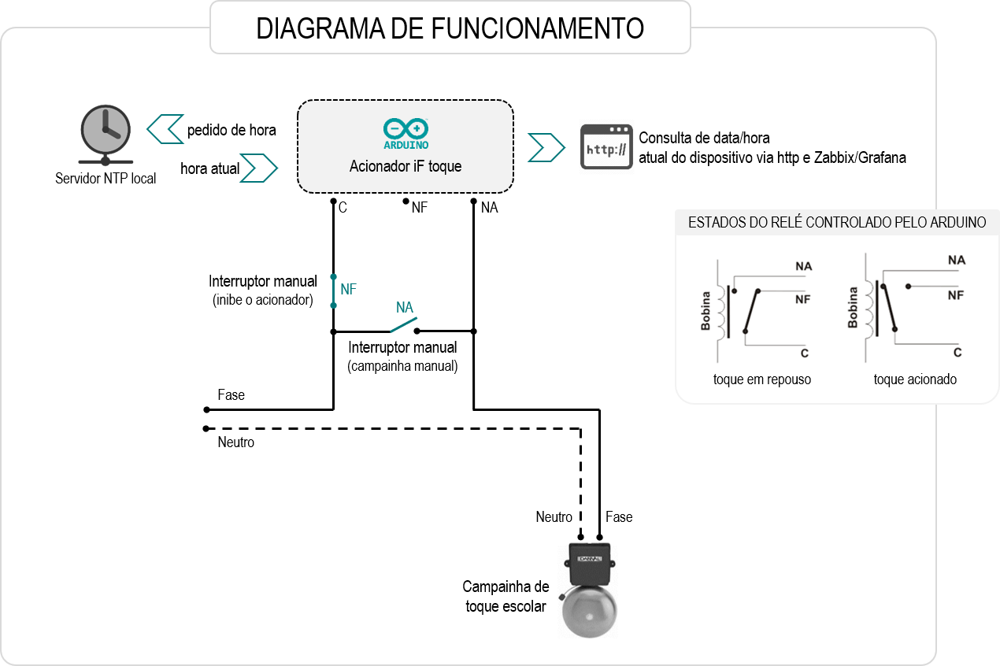

# iF-toque
Sistema para controle de toque escolar (sineta/sirene) baseado em arduino com uso de rele com atualização de hora pela rede através de protocolo NTP.
As horas dos toques ficam no código fonte na função timeToStudy() e são separadas por toque longo ou toque curto. O toque curto é utilizado quando não há intervalos entre as aulas e dura por padrão 3s. O toque longo dura por padrão 7 segundos (horário do inicio ou fim do intervalo, inicio de turno, etc). Feriados fixos estão definos na função DiadeAula () que retorna para timeToStudy() se o toque deve ser acionado ou não.

**Utilizado:**
* Arduino Uno
* Módulo de Rele 5v para arduino
* Shield ethernet w5110
* Servidor NTP (local ou da Internet)



**Gerenciamento opcional com Zabbix e Grafana:**


**Arquivo userparameter no Zabbix Server**

/etc/zabbix/zabbix_agentd.d/userparameter_alex.conf
```
# iFtoque - gerenciamento
UserParameter=iFtoque.Hora,lynx -dump http://192.168.1.110 | grep  'Agora' | awk '{print $5}'
UserParameter=iFtoque.Unixtime.Add3hs,hora=$(lynx -dump http://192.168.1.110 | grep  'Time' | awk '{print $3}'); expr $hora + 10800
UserParameter=iFtoque.Uptime,lynx -dump http://192.168.1.110 | grep  'Time' | awk '{print $5}'
UserParameter=iFtoque.HorarioAula.Atual,lynx -dump http://192.168.1.110 | grep  'º' | sed -n 1p | sed 's/  //g'
UserParameter=iFtoque.HorarioAula.Proximo,lynx -dump http://192.168.1.110 | grep  'º' | sed -n 2p | sed 's/  //g'

# Zabbix Gerencia de hora
UserParameter=Zabbix.Hora, date '+%H:%M:%S'
```
